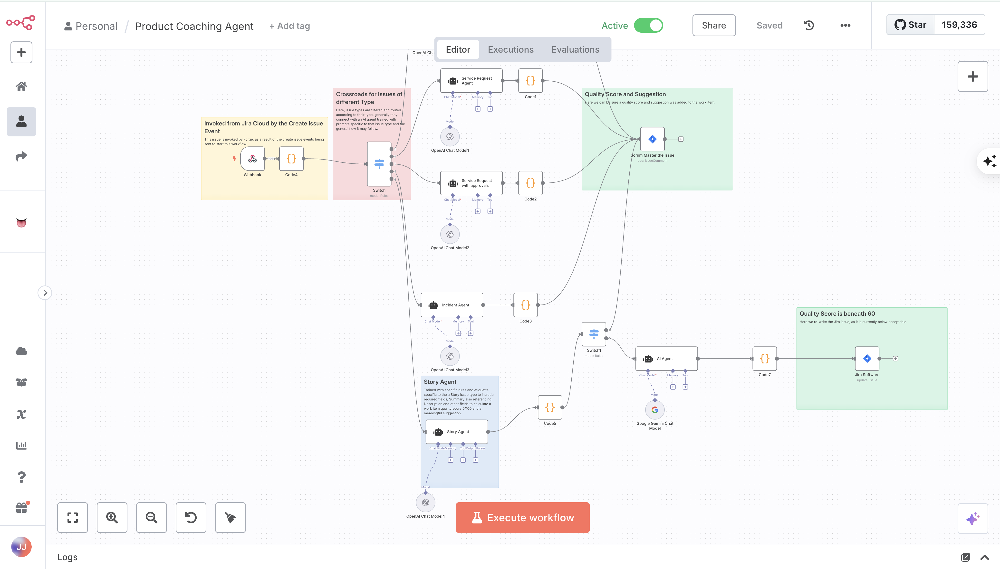
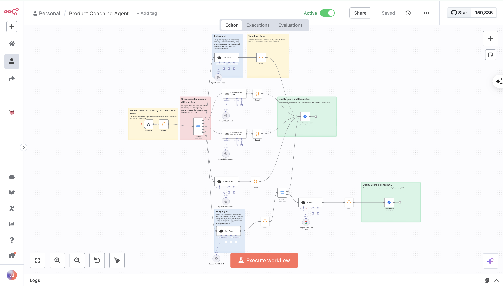

# Confluence PII Detector & n8n Integration

This Forge app automatically scans Confluence pages for Personally Identifiable Information (PII) and reports findings to an n8n webhook. It is designed to help organizations maintain data security and compliance by proactively identifying sensitive data leaks.



## Features

- **Real-time PII Detection**: Automatically scans page content when created or updated.
- **Comprehensive Scanning**: Detects various PII types including:
  - Social Security Numbers (SSN)
  - Credit Card Numbers
  - Email Addresses
  - Phone Numbers
  - Passport Numbers
  - Driver's Licenses
  - IP Addresses
- **Deep Space Scanning**: If PII is found on a page, the app automatically triggers a scan of other pages in the same space to identify widespread issues.
- **Version History Analysis**: Checks historical versions of pages to ensure no sensitive data is hidden in past edits.
- **n8n Integration**: Sends detailed JSON reports of all findings to a configured n8n webhook for further processing, alerting, or automated remediation.



## Configuration

To use this app, you must configure the n8n webhook URL where reports will be sent.

1. Deploy and install the app:
   ```bash
   forge deploy
   forge install
   ```

2. Set the `N8N_WEBHOOK_URL` environment variable:
   ```bash
   forge variables set N8N_WEBHOOK_URL <your-n8n-webhook-url>
   ```

## Usage

Once installed and configured, the app works automatically in the background.
1. Create or update a Confluence page.
2. If PII is detected, the app logs the findings and sends a report to n8n.
3. Check your n8n workflow executions to see the incoming reports.

## Development

- Run the app locally:
  ```bash
  forge tunnel
  ```
