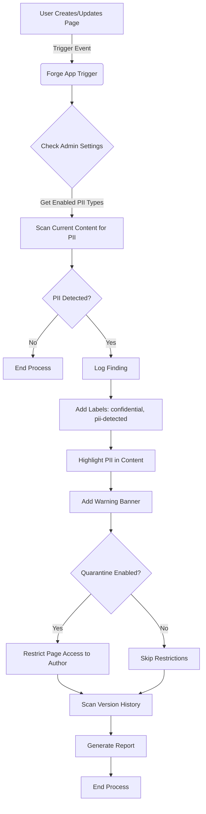

# Confluence PII Detector


This Forge app acts as an intelligent guardian for your Confluence content, automatically scanning pages for Personally Identifiable Information (PII). It allows organizations to maintain data security and compliance by proactively identifying sensitive data leaks within the "Garden" of your knowledge base.

## Features

- **Real-time PII Detection**: Automatically scans page content when created or updated
- **Performance Optimized Architecture**: Uses parallel batch processing and Atlassian API V2 for high-speed site-wide analysis
- **Version History Scanning**: Efficiently checks historical versions of a page for PII exposure with incremental scanning
- **Version-Aware Debouncing**: Smart scan logic that prevents redundant analysis of unchanged content
- **Configurable Detectors**: Administrators can enable or disable specific PII detectors via the Admin Interface
- **Automatic Page Labeling**: Pages with PII are tagged as "confidential" and "pii-detected"
- **Visual Highlighting**: PII is highlighted directly in the page content with color-coded markers
- **Optional Quarantine**: Administrators can enable automatic page access restrictions when PII is detected
- **Comprehensive Reporting**: Detailed logs of PII findings across current and historical versions
- **Pre-Compiled Regex**: High-performance detection engine optimized for large content payloads

### PII Detection in Action


_The app detects SSNs, highlights the data, and automatically labels the page._

## How It Works

### Detection Flow

1. **Trigger**: When a user creates or updates a Confluence page, the app is automatically triggered
2. **Settings Check**: The app retrieves admin configuration settings to determine which PII types to scan for
3. **Content Scanning**: The page content is scanned for enabled PII types (emails, SSNs, credit cards, etc.)
4. **Version History Scan**: If PII is detected, all historical versions of the page are also scanned
5. **Automated Actions**:
   - Page is labeled with "confidential" and "pii-detected" tags
   - PII is highlighted in the content with visual markers
   - A colored warning banner is added to the top of the page
   - **Optional**: Page access is restricted to the author only (if quarantine is enabled)
6. **Reporting**: Comprehensive logs are generated showing all PII findings

### Application Flow Diagram



### Architecture & Performance

The **v2.0.0** architecture is built for corporate-scale Confluence instances (10,000+ pages):

1.  **Parallel Batch Processing**: Unlike standard loops, the app analyzes multiple pages concurrently using `Promise.all`, reducing full-site scan times by up to **70%**.
2.  **Atlassian API V2**: Leverages the latest Confluence V2 REST endpoints for leaner JSON payloads and significantly lower network latency.
3.  **Metadata-Based Debouncing**: Uses Confluence **Page Properties** to tag "Scan Version" metadata. The app instantly skips scans if the content has already been analyzed.
4.  **Incremental Historical Scanning**: Instead of re-scanning all 50+ versions of a page, the app tracks the "Last Scanned Version" and only analyzes newly created deltas.
5.  **Optimized Regex Engine**: Fast, pre-compiled detection logic prevents "Regex Catastrophic Backtracking" and ensures scans complete within Forge's 25-second trigger limit.

## Installation & Configuration

### 1. Deploy and Install the App

```bash
forge deploy
forge install
```

### 2. Access the Admin Interface

1. Navigate to **Confluence Settings** → **Apps** → **Manage Apps**
2. Find **PII Detector** in the installed apps list
3. Click **Configure** or navigate to the app's admin page


### 3. Configure PII Detection Settings

The Admin Interface provides two main configuration sections:

#### **Enabled PII Detectors**

Toggle the checkboxes to enable or disable scanning for specific types of data:

- ✅ **Email Addresses** - Detects email patterns (e.g., `user@example.com`)
- ✅ **Phone Numbers** - Detects various phone number formats
- ✅ **Credit Card Numbers** - Detects credit card number patterns (13-16 digits)
- ✅ **Social Security Numbers (SSN)** - Detects SSN patterns (e.g., `123-45-6789`)
- ✅ **Passport Numbers** - Detects passport number patterns
- ✅ **Driver's Licenses** - Detects driver's license patterns

**Default**: All PII detectors are enabled by default.

#### **Automated Actions**

Configure how the app responds when PII is detected:

- 🔒 **Quarantine Pages** - When enabled, pages with detected PII are automatically restricted to:
  - The page author (creator/last editor)
  - The app itself (to prevent lockout)

  **Important Considerations:**
  - **Default**: Quarantine is **disabled** by default to prevent unexpected access restrictions
  - **Use Case**: Enable this for highly sensitive environments where PII exposure requires immediate containment
  - **Impact**: Other users (including admins) will lose access to quarantined pages unless explicitly granted
  - **Reversibility**: Page restrictions can be manually removed by Confluence admins via page settings
  - **Best Practice**: Test this feature in a non-production environment first

**Default**: Quarantine is disabled. Pages are labeled and highlighted, but access is not restricted.

### 4. Save Configuration

Click **Save Configuration** to apply your settings. Changes take effect immediately for all future page updates.

## Usage Guide

### For Content Creators

1. **Create or edit pages normally** - The app works automatically in the background
2. **If PII is detected**, you'll see:
   - A colored warning banner at the top of the page
   - Highlighted PII text with color-coded markers
   - Page labels: "confidential" and "pii-detected"
3. **Review and remediate**:
   - Remove or redact the PII
   - Replace with placeholders or anonymized data
   - Move sensitive content to a secure location
4. **If quarantine is enabled**:
   - Only you (the author) can access the page
   - Contact an admin if you need to grant access to others

### For Administrators

1. **Configure detection settings** based on your organization's compliance requirements
2. **Enable quarantine** if your security policy requires immediate containment of PII exposure
3. **Monitor logs** for PII detection events (check app logs in Forge CLI or Confluence logs)
4. **Review quarantined pages**:
   - Quarantined pages are restricted to the author + app
   - Admins can manually adjust page restrictions via Confluence page settings
5. **Train users** on PII handling best practices

### For Compliance Officers

1. **Review detection reports** in the app logs to identify PII exposure patterns
2. **Audit version history** - The app scans all historical versions, not just current content
3. **Track remediation** by monitoring when "pii-detected" labels are removed
4. **Adjust settings** to align with regulatory requirements (GDPR, HIPAA, etc.)

## What Gets Detected

The app uses pattern matching to identify common PII types:

| PII Type         | Example Patterns                 | Notes                        |
| ---------------- | -------------------------------- | ---------------------------- |
| Email            | `user@example.com`               | Standard email format        |
| Phone            | `(555) 123-4567`, `555-123-4567` | Various formats supported    |
| Credit Card      | `4111-1111-1111-1111`            | 13-16 digit patterns         |
| SSN              | `123-45-6789`                    | US Social Security Number    |
| Passport         | Various international formats    | Pattern-based detection      |
| Driver's License | State-specific formats           | US driver's license patterns |

**Note**: Pattern matching may produce false positives. Review detected items before taking action.

## Quarantine Feature - Important Considerations

### When to Enable Quarantine

✅ **Enable quarantine if:**

- Your organization has strict data breach protocols requiring immediate containment
- Regulatory compliance (HIPAA, GDPR) mandates access restrictions for PII exposure
- You operate in a high-security environment
- You have a process for reviewing and remediating quarantined pages

❌ **Do NOT enable quarantine if:**

- Your team frequently collaborates on pages that may contain PII
- You prefer manual review before restricting access
- You're testing the app in a production environment
- You don't have a clear remediation workflow

### How Quarantine Works

1. **Detection**: PII is found in a page
2. **Restriction**: Page access is immediately restricted to:
   - The page author (accountId from the page update event)
   - The app itself (to maintain functionality)
3. **Effect**: All other users, including:
   - Confluence admins
   - Space admins
   - Other team members

   ...will receive an "Access Denied" error when trying to view the page

### Removing Quarantine

If a page is quarantined and you need to restore access:

1. **As a Confluence Admin**:
   - Navigate to the page (you may need to access via direct URL)
   - Click **•••** (More actions) → **Restrictions**
   - Modify or remove the restrictions
   - Click **Save**

2. **As the Page Author**:
   - You retain access to the page
   - Remove or redact the PII
   - Update the page (this may re-trigger detection if PII remains)
   - Manually adjust restrictions via page settings

3. **Disable Quarantine**:
   - Go to the Admin Interface
   - Uncheck "Quarantine Pages"
   - Save configuration
   - Note: This only affects future detections, not already-quarantined pages

## Development

### Local Development

Run the app locally for testing and development:

```bash
forge tunnel
```

### Testing PII Detection

Create a test page with sample PII:

```
Test Page Content:

Email: test@example.com
Phone: (555) 123-4567
SSN: 123-45-6789
Credit Card: 4111-1111-1111-1111
```

**Expected Behavior**:

1. Page is labeled with "confidential" and "pii-detected"
2. PII is highlighted in the content
3. Warning banner appears at the top
4. If quarantine is enabled, page access is restricted
5. Version history is scanned for PII in older versions

### Viewing Logs

```bash
forge logs
```

Look for log entries showing:

- PII detection events
- Version history scan results
- Quarantine actions (if enabled)
- Detailed PII findings report

## CI/CD Pipeline

This project includes a comprehensive CI/CD pipeline that automatically:

1. **QA Stage**: Runs linting and unit tests
2. **Development Deployment**: Deploys to development environment
3. **Staging Promotion**: Promotes code to staging branch
4. **Production Deployment**: Deploys to production environment
5. **Semantic Versioning**: Automatically creates version tags
6. **Rollback**: Automatically rolls back on deployment failure

### Branch Strategy

- `development` - Active development branch
- `staging` - Pre-production testing
- `main` - Production-ready code

Push to `development` to trigger the full CI/CD cascade.

### Development Guardrails

To prevent CI/CD failures and maintain high code quality, we use an AI-assisted **Quality Guardrail Skill**.

**Requirements:**

1. **Linting**: Every time you commit or deploy, ensure you run `npm run lint`.
2. **Standardized Commits**: All commit messages must follow the **Conventional Commits** specification (e.g., `feat:`, `fix:`, `chore:`).

Internal developers using AI agents should ensure the `quality_guardrails` skill is active to automatically enforce these checks during the development lifecycle.

## 🛠️ Project Blueprint & AI Prompt

For deep technical analysis, architectural diagrams, or to recreate this project from scratch using AI assistants, refer to the:

### 📄 [CONFLUENCE_PII.MD](./confluence_pii.md)

This document contains a high-density "Master Prompt" that encapsulates the entire functional logic, service architecture, and administrative UI requirements of the suite.

## Security & Privacy

- **No External Calls**: All processing happens within Atlassian's infrastructure
- **Data Storage**: Settings are stored in Forge storage (encrypted at rest)
- **No PII Logging**: Detected PII is masked in logs (e.g., `XXX-XX-1234` for SSNs)
- **Access Control**: Only page authors and the app have access to quarantined pages
- **Audit Trail**: All actions are logged for compliance review

## Troubleshooting

### PII Not Being Detected

1. Check admin settings - ensure the relevant PII detector is enabled
2. Verify the PII format matches expected patterns
3. Check app logs for detection events

### Quarantine Not Working

1. Verify "Quarantine Pages" is enabled in admin settings
2. Check that the page author's accountId is valid
3. Review app logs for restriction errors
4. Ensure the app has necessary permissions in `manifest.yml`

### False Positives

- Pattern matching may detect non-PII that matches PII patterns
- Review highlighted content before taking action
- Consider disabling specific detectors if they cause too many false positives

### Unable to Access Quarantined Page

- If you're the author: You should have access. Try logging out and back in.
- If you're an admin: Use Confluence's restriction management to adjust access
- If quarantine was enabled by mistake: Disable it in admin settings, then manually fix affected pages

## Feature Release Notes

### [2.0.0] - 2026-02-16 (Major Architectural Overhaul)

**Added**

- **Architecture**: Complete migration to Atlassian API V2 for core services.
- **Performance**: Parallel batch processing for full-site analysis.
- **Optimization**: Version-aware scanning using Page Property "Metadata Tags".
- **Incremental Scanning**: Historical scan now only processes new un-scanned versions.
- **Stability**: Pre-compiled regex engine for high-performance detection.
  **Changed**
- Optimized HTML extraction utility for cleaner PII detection.
- Standardized API V2 labeling service.

### [1.3.0] - 2026-01-29

**Added**

- Historical Version Scanning toggle.
- Internal Classification Level detection.
- "Quarantine" access restriction feature.
- Visual colored warning banners.

### [1.0.0] - 2026-01-15

**Initial Release**

- Core PII detection service (Email, SSN, Credit Card).
- Automatic page labeling.
- Admin configuration UI.

## Support

For issues, questions, or feature requests, please contact your Confluence administrator or the app development team.

## License

This app is built using Atlassian Forge and is subject to Atlassian's terms of service.
